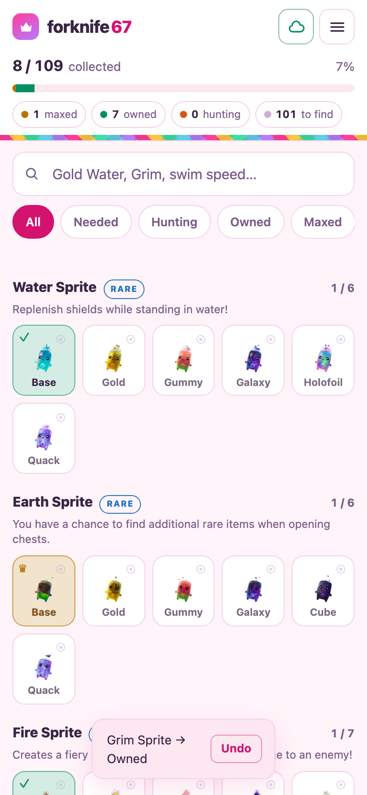

# forknife 67

A sprite tracker for Fortnite.

In game there is no way to tell whether a sprite is already in your inventory —
unless it's **maxed**, in which case it wears a crown. Everything you own below
max level looks exactly like something you've never picked up. So you extract
duplicates, or skip ones you actually needed.

This is the missing list. One tap per sprite, works offline, syncs between your
phone and your PC.



## What it does

- **All 109 sprites and variants**, named and pictured, grouped by base sprite,
  with each sprite's power, rarity and where it spawns
- **Three states**, cycled with a single tap:
  - **Needed** — not in your collection
  - **Owned** — extracted but not mastered, *invisible to you in game*
  - **Maxed ♛** — mastered, so it wears a crown
- **Hunting list** — flag the ones you're actively looking for; a sprite drops
  off the list automatically the moment you mark it found
- **Search** by name, by what a sprite does, or by where it spawns; **filter**
  by any state
- **Chest odds and summon cost** on every entry, so "hunt it or buy it with
  dust" is an answerable question
- **Undo** on every change, because a mis-tap happens
- **Installable** — add it to your home screen and it opens full screen, offline;
  iPhone gets the Share-sheet steps, since Safari never fires an install prompt
- **Optional cloud sync** — one vault code, no account, no email
- Dark and light themes, compact grid mode

## Why "Owned" matters most

"Maxed" you can already see in game. The state this app exists for is **Owned** —
extracted, not mastered, therefore indistinguishable in game from one you've
never found. Mark a sprite the moment you extract it and the guessing stops.

## Where the sprite data comes from

`public/lib/catalog.js` holds 25 base sprites and 118 entries, 109 of them
obtainable. Names, rarities, power text, level scaling, spawn locations, drop
rates and dust costs are read out of the game files; Epic's patch notes and
IGN's checklist are the second sources.

### Why the published totals disagree

You will see 109, 111 and 118 quoted for the same season. All three are right,
about different things:

| Count | What it is |
| ----- | ---------- |
| **109** | Obtainable right now. What the app tracks, and what every source agrees on. |
| **111** | IGN's figure — the 109 plus two that shipped and were pulled back. |
| **118** | The game files — everything above plus seven variants that have never been released. |

So the app keeps three states rather than a released flag. Ironmouse and Gem
Grim went live on 30 July and were vaulted a day later for going out early;
Ironmouse is back on 4 August, and the app says so on the entry. The other
seven Gem variants have never shipped at all. Turn on **Menu → Catalog** to see
them; the totals stay honest either way.

IGN also counts "20 base Sprites", which is the 20 that have variant families —
the five collab Mythics (Burnt Peanut, Vini Jr., Pollo, John Wick, Ironmouse)
have none. 20 + 5 = the same 25 the game files list.

### Names

The game files and the patch notes disagree on four — the game says *Grim*,
*Llama*, *Peely* and *Burnt Peanut* where the patch notes say *Grim Reaper*,
*Lootin' Llama*, *Peeky Peely* and *TheBurntPeanut*. The game's spelling is what
the app shows, and both are searchable, so it does not matter which one you
know.

Popular fan checklists get several of these names wrong, disagree with each
other on the total (91, 109 and 111 are all in circulation) and misreport what
the variants do. Two of `test/catalog.test.js`'s assertions exist to stop those
numbers drifting back in.

Epic ships sprites faster than this app redeploys, so **Menu → Add your own**
tracks one the day it lands, and entry ids are derived from a stable key rather
than a position — adding a sprite to the catalog can never scramble a
collection anyone has already recorded.

### Keeping it current

`.github/workflows/catalog-drift.yml` runs `tools/check-catalog-drift.js` daily.
It reads IGN's checklist, resolves every sprite name it finds against the
catalog, compares the totals, and files one issue when something doesn't line
up. `test/drift.test.js` pins it at both ends — it has to catch a new sprite
*and* a new variant of an existing one, and it must not fire on prose like
"Master Sprites" or on a Mastery reward that happens to mention a number.

**It detects; it never edits.** The catalog ships inside the app so the app
works with no signal — that is the whole point of a tracker you use mid-match
on mobile data — and a scraper writing to it unreviewed would publish whatever
a wiki edit or a changed page layout produced, to someone with no way to notice
it was wrong. Filling in a newly spotted sprite is a hand step, and needs a real
browser: fortnite.gg refuses plain fetches *and* headless ones (403 both ways).

Artwork is Epic's, re-hosted by fortnite.gg, fetched by
`tools/fetch-sprite-art.js` and committed under `public/sprites/`. The 512px
originals would be 3.2 MB; resized to 96px the whole set is 232 KB. Fan projects
may use Epic's assets non-commercially under the Fan Content Policy.

## Running it locally

Node 22+. The app itself has no runtime dependencies.

```bash
npm start           # http://localhost:8080 — plain Node, nothing to install
npm test            # 80 unit, catalog, drift + API tests
npm run icons       # regenerate the PWA icons
```

To run the thing production actually runs:

```bash
npm install         # wrangler, the only devDependency
npm run dev:worker  # the Worker + Durable Object under workerd
npm run test:worker # 21 contract tests against a real `wrangler dev`
```

Browser end-to-end tests (39 checks, needs Chromium):

```bash
npm install --no-save playwright
npx playwright install chromium
node test/browser-smoke.mjs
```

`BASE_URL` points that suite at anything already running, which is how the
Worker gets the same 39 checks rather than a second suite that only rhymes
with them:

```bash
npm run dev:worker &
BASE_URL=http://127.0.0.1:8787 node test/browser-smoke.mjs
```

All of it runs in CI on every push.

## Deploying

It runs on **Cloudflare Workers**, on the free plan:

```bash
npm run deploy
```

Static files are served straight from the edge without spending a Worker
invocation; only `/api/*` runs the script. Once `CLOUDFLARE_API_TOKEN` is set as
a repository secret, merges to `main` deploy themselves via
`.github/workflows/deploy.yml` — tests first.

There is no server to patch, no certificate to renew, and no bill. The free
plan allows 100,000 Worker requests and 100,000 Durable Object requests per
day; a personal tracker uses a rounding error of that.

To host it yourself instead, `server/server.js` is a complete standalone
server — `npm start` behind any reverse proxy, no Cloudflare involved.

## How it's built

No framework, no build step, no database.

```
public/
  index.html          app shell
  styles.css          all styling
  app.js              all behaviour
  lib/vault.js        data model + merge logic — shared by all three runtimes
  lib/catalog.js      every sprite, variant and stat, read from the game files
  sprites/            Epic artwork, one 96px webp per entry id
  sw.js               offline service worker
  _headers            security + cache headers for the edge-served assets
src/
  worker.js           the deployed sync API
  vault-object.js     one Durable Object per vault
server/server.js      the same API on plain Node, for local and LAN use
tools/                icon generation, artwork fetch, catalog drift check
test/                 unit, catalog, drift, API, Worker and browser tests
```

`public/lib/vault.js` is imported by the browser, the Worker and the Node
server, so none of them can disagree about what a merge means. The two server
implementations are thin adapters over it, and both are held to the same
externally visible contract by their test suites.

### Data model

An entry is `{id, name, status, hunting, notes, updatedAt}`, keyed by a catalog
id: `water`, `water.gold`, `custom.3`. Ids come from the sprite's key rather
than its position in the list, which is what lets the catalog grow with the
game without disturbing anything already recorded. Untouched entries aren't
stored at all, so a fresh install syncs a few hundred bytes.

The vault validates the *shape* of an id, not membership of the catalog. A
phone that hasn't picked up the latest deploy stores and syncs an entry it has
never heard of untouched, rather than deleting progress made on a device that
has.

Everything is kept in `localStorage` first — the app is fully functional with
the server switched off. Sync is strictly additive.

### Sync

Enter the same **vault code** on two devices and they converge. Merging is
per-entry last-write-wins on `updatedAt`, so marking Gold Water on your phone
and Grim on your PC keeps both edits — whole-document last-write-wins would
silently drop one. `public/lib/vault.js` is imported by both the browser and
the server, so the two can't disagree about what a merge means.

Server-side, a vault is one Durable Object addressed by `sha256(code)` — so the
code itself is never stored or logged — holding the document in SQLite. There is
exactly one single-threaded instance per vault, which is what stops two devices
syncing at the same instant from clobbering each other. (The Node server builds
the same guarantee by hand, with a promise-chain lock and atomic file writes.)

**A vault code is a password.** Anyone who has it can read and change your list.

## Licence

MIT
